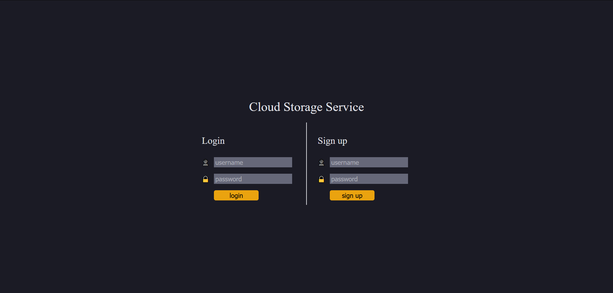

# Cloud Storage Project

## About 
This project was built with AWS API Gateway, AWS Lambda, AWS DynamoDB, and AWS S3 for the backend. The frontend was written with vanilla javascript. Users can upload files to store on the cloud through the website. They can upload and download files to the app.

The links to access the api, found in the frontend directory, are currently turned off, just in case malefactors want to overload my AWS free tier limits.

Maven shade plugin is used to create a jar with all of the dependencies wrapped in. You can generate one to upload to lambda by cd'ing into the cloudStorageService directory and running "mvn clean package" in the terminal.

## Screenshot

